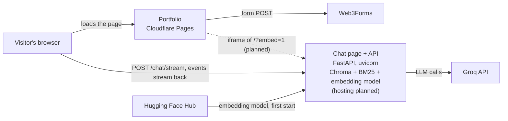
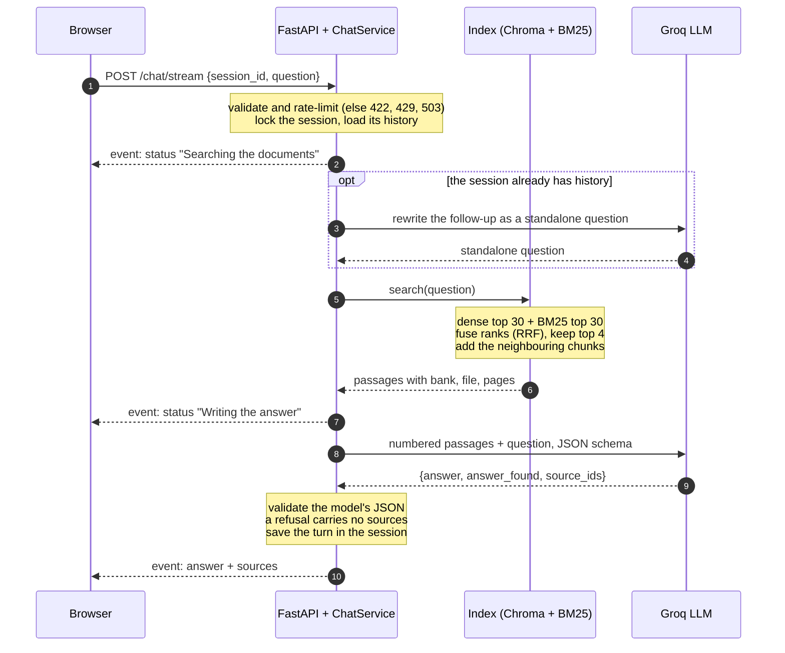
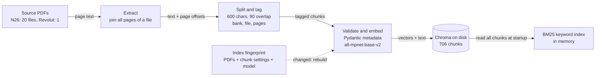

# Architecture

A chatbot that answers questions about N26 and Revolut fees **only from the banks' own PDFs**, shows the page each answer came from, and says so when the documents do not cover the question.

The diagrams below are Mermaid, so GitHub renders them and they live next to the code.

## Where everything runs

The chat is a page served by the API host. The portfolio frames it in an iframe, so the portfolio needs no chat code and no CORS setup, and the Groq key never leaves the server. Only the origins listed in `CORS_ORIGINS` may frame the page.

## One question, end to end

Nothing is shown until it has been validated: the model returns JSON that is checked before the page sees it. If any step fails, the last event is `error` with a code (`rate_limited`, `timeout` or `unavailable`).

## How documents become searchable

Joining the pages before splitting keeps a price row whole: N26 puts a fee's heading and price at the bottom of one page and its description at the top of the next. Each chunk records the pages it spans, which is where "pages 5–6" in a citation comes from.

## Where each guarantee is enforced

| Guarantee | How | Code | Checked by |
|---|---|---|---|
| Input is bounded and safe | Pydantic request model: 1 to 500 characters, session id limited to letters, digits, `_` and `-` | `schemas.py` | unit and API tests (HTTP 422) |
| Visitors never see each other's history | Per-session memory, one lock per session, oldest sessions evicted first | `sessions.py` | session and chat tests |
| The answer comes from the right passage | Hybrid search over small chunks, each widened with its neighbours | `hybrid.py` | `python -m feesbot recall` |
| A refusal never cites sources | The model declares whether it found the answer; the response model rejects a refusal that carries sources | `schemas.py`, `chat.py` | schema tests, refusal cases in the live eval |
| The model does not invent rules | Prompt forbids inferring how fees combine; the eval rejects known invented phrasing | `prompts.py`, `evaluation.py` | `python -m feesbot eval` |
| Model output cannot attack the page | Escape everything first, no links, strict content-security policy, framing limited to the portfolio | `markdown.js`, `api.py` | JavaScript tests, injection attempt in a real browser |
| Provider failures are explained | Rate limit, timeout and other failures map to 429, 504 and 503, or to an error event mid-stream | `chat.py`, `api.py` | API tests |
| A stale index is never served | Fingerprint of the PDFs and settings; a mismatch rebuilds | `fingerprint.py` | fingerprint tests |
| Strangers cannot drain the LLM quota | Per-visitor rate limit, concurrency caps, a global cap and a daily budget. A slot expires if a client vanishes mid-answer, and forwarded addresses are trusted only when configured | `limits.py`, `api.py` | unit and API tests, real-browser checks |

## Decisions worth defending

- **Hybrid search, chosen by measurement.** Embedding search alone never returned the row holding the N26 replacement fee, and a larger `k` did not help. Recall on 15 golden questions went 10, then 12 with keyword search added, then 15 with small chunks and neighbour windows. A reranker and a different embedding model added nothing, so neither is in the system. The settings were tuned on the same facts they are scored on, so the number is optimistic and the evaluation set needs to keep growing.
- **Stream progress, not raw tokens.** The model answers in structured JSON that can only be validated once complete; streaming its tokens would show unvalidated text.
- **The chat is a page, and the portfolio frames it.** One copy of the chat code, usable as a plain link. The cost is that a sleeping free host cannot serve the page, so the "waking up" message has to live in the modal.
- **Memory lives in the process.** Simple and fast, bounded by a session cap. With several workers it would move to Redis.
- **Chroma on local disk.** 706 chunks need no separate database. A larger corpus or several writers would call for a hosted vector store.
